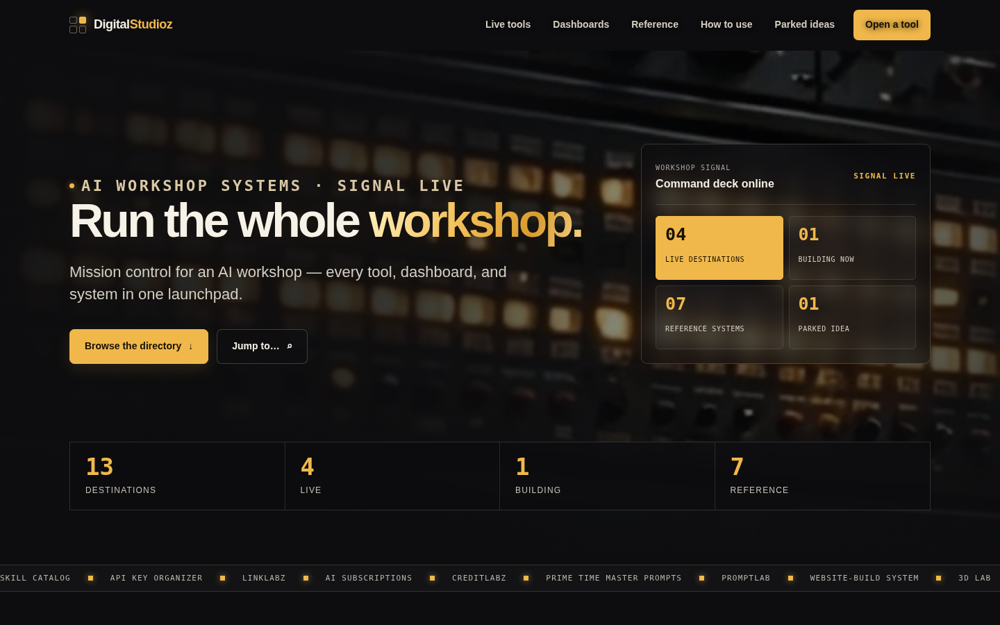

# DigitalStudioz Hub

> Mission control for Jon's AI workshop — every tool, dashboard, and system in one launchpad.

[](https://agentzlab.github.io/DigitalStudioz-Hub/)
[](#)
[](#workflow)

## Live preview

https://agentzlab.github.io/DigitalStudioz-Hub/



## What's inside

A single-page directory of the studio: live tools, studio dashboards, building prototypes, reference docs, and parked ideas — each as a numbered card with a status (Live / Building / Reference / Parked), a color-coded status band, grid/list toggle, and a Cmd/Ctrl-K jump palette.

- **Live tools** — Skill Catalog, API Key Organizer, LinkLabz, …
- **Studio dashboards** — CreditLabz, Prime Time Master Prompts, …
- **Search & filter** — status filters, text jump, grid/list views

## Design language

Dark charcoal command-deck aesthetic: near-black surfaces, hairline borders, status-color coding (green = live, gold = building, neutral = reference, red = parked), mono accents for metadata, generous whitespace. Calm, dense, scannable — a tool, not a brochure.

## Tech stack

| Layer | Choice |
|---|---|
| Markup | Single self-contained `index.html` |
| Styling | Inline CSS (dark command-deck theme) |
| Behavior | Vanilla JS (filters, jump palette, grid/list) |
| Hosting | GitHub Pages (static) |

## Project structure

```
DigitalStudioz-Hub/
├── index.html            # the Hub (self-contained)
├── assets/
│   └── screenshot.png    # dark-mode hero (refresh on every build change)
├── .nojekyll             # Pages: no Jekyll processing
└── README.md
```

## Workflow

Changes land on **new branches only** — never push straight to `main`. No pull requests unless Jon asks. Screenshots and the README hero stay current with every build change. Shared-artifact edits get an FYI note to Ravyn on the bridge naming exactly what changed.
